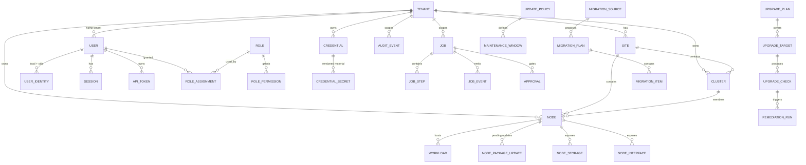

# Velnox — Database Schema Proposal

**Status:** Phase 0 design proposal. PostgreSQL 16, Prisma migrations.
This is the high-level model: entities, key fields, relationships and the rules that make tenancy
and secret handling safe. Column-level detail is finalised per phase in the actual Prisma schema.

---

## 0. Conventions

- **Primary keys:** `id` — UUID v7 (time-sortable, index-friendly, non-guessable).
- **Timestamps:** `created_at`, `updated_at` on every table; `deleted_at` (soft delete) only where
  history matters — never on `audit_events`.
- **Tenancy:** every tenant-scoped table carries a **non-null `tenant_id`**, plus denormalised
  `site_id` / `cluster_id` where they exist. Denormalisation is deliberate: it lets the RBAC scope
  check and the Prisma tenancy extension filter on the row itself instead of walking joins.
- **Enums** are PostgreSQL enums generated from the shared TypeScript catalogue.
- **Secrets** never appear as a plain column anywhere. Only `credential_secrets.ciphertext`
  contains encrypted material.
- **`audit_events`** is append-only, enforced by a table trigger that rejects `UPDATE` and `DELETE`
  from the application role.

---

## 1. Entity relationship overview

---

## 2. Tenancy and organisation

### `tenants`
| Column | Type | Notes |
|---|---|---|
| id | uuid | |
| name | text | |
| slug | citext unique | used in URLs |
| kind | enum | `MSP_ROOT` \| `CUSTOMER` |
| parent_tenant_id | uuid null | reserved for future sub-tenants; v1 is one level under root |
| status | enum | `ACTIVE` \| `SUSPENDED` \| `ARCHIVED` |
| settings | jsonb | branding, defaults, notification targets |

**Invariant:** exactly one row with `kind = MSP_ROOT`, enforced by a partial unique index. It is
created by the setup wizard and can never be deleted.

### `sites`
`id, tenant_id, name, code, address, timezone, contact, notes` — a physical or logical location.
Clusters and standalone nodes belong to a site; a site belongs to exactly one tenant.

---

## 3. Identity, sessions and RBAC

### `users`
`id, tenant_id (home tenant), email citext unique, display_name, status (ACTIVE|DISABLED|INVITED),
password_hash (nullable — SSO-only users have none), password_algo, must_change_password,
mfa_enrolled, token_version int, last_login_at, failed_login_count, locked_until`

`password_hash` holds an Argon2id PHC string. `token_version` increments on password change,
role change or forced logout and invalidates outstanding access tokens.

### `identity_providers`
`id, kind (LOCAL|OIDC), name, enabled, discovery_url, client_id, client_secret_ref (→ credentials),
tenant_id_claim, allowed_email_domains, auto_provision (bool), default_role_id, default_tenant_id,
jit_group_mappings jsonb`

The Entra ID client secret is **not** a column — it is a reference into the credential store.

### `user_identities`
`id, user_id, provider_id, subject (provider's stable id), email_at_link, linked_at`
Unique on `(provider_id, subject)`. Matching an OIDC login is by `subject` first, falling back to a
verified email only when the provider is configured to allow it.

### `sessions`
`id, user_id, refresh_token_hash, family_id, parent_id, ip, user_agent, created_at, last_used_at,
expires_at, revoked_at, revoked_reason`
Refresh rotation creates a child row; presenting an already-rotated token revokes the whole
`family_id` (reuse detection).

### `api_tokens`
`id, tenant_id, user_id, name, token_hash, prefix, scopes (permission[]), scope_type, scope_id,
expires_at, last_used_at, revoked_at`

### `roles`
`id, key, name, description, is_system (bool), tenant_id (null = global/system role)`
System roles are seeded and immutable. Tenant-defined custom roles carry a `tenant_id`.

### `role_permissions`
`role_id, permission` — `permission` is a text value validated against the frozen catalogue in
`packages/shared`. Kept as text rather than a foreign key to a permissions table so adding a
permission is a code change plus a data migration, not a runtime data-entry surface.

### `role_assignments`
| Column | Notes |
|---|---|
| id, user_id, role_id | |
| scope_type | `GLOBAL` \| `TENANT` \| `SITE` \| `CLUSTER` |
| scope_id | null when `GLOBAL` |
| granted_by, granted_at, expires_at | time-boxed elevation is supported |

Unique on `(user_id, role_id, scope_type, scope_id)`. `GLOBAL` is only insertable for users whose
home tenant is the MSP root — enforced in the service layer *and* by a check constraint via a
trigger.

---

## 4. Proxmox inventory

### `clusters`
`id, tenant_id, site_id, name, kind (CLUSTER|STANDALONE), pve_version, quorum_ok, quorate_nodes,
expected_votes, ceph_present, ceph_health, health (OK|WARNING|CRITICAL|UNKNOWN),
last_seen_at, last_discovery_at, discovery_error`

A standalone node is modelled as a cluster of one. That keeps every downstream code path — rolling
updates, upgrade plans, guards — uniform instead of branching on "is this standalone".

### `nodes`
| Group | Columns |
|---|---|
| identity | `id, tenant_id, site_id, cluster_id, hostname, fqdn, address, api_port, ssh_port` |
| connection | `api_credential_id, ssh_credential_id, tls_fingerprint_sha256, tls_verify_mode, ssh_host_key_fingerprint` |
| version | `pve_version, pve_release, kernel_version, debian_release, subscription_status, repository_status jsonb` |
| health | `status (ONLINE|OFFLINE|UNKNOWN|MAINTENANCE), health, uptime_seconds, last_seen_at` |
| capacity | `cpu_sockets, cpu_cores, cpu_model, cpu_usage_pct, mem_total_bytes, mem_used_bytes, disk_total_bytes, disk_used_bytes` |
| updates | `updates_available_count, security_updates_count, kernel_update_pending, reboot_required, last_update_check_at` |
| flags | `maintenance_mode, managed (bool), notes` |

`tls_verify_mode` is `PINNED_FINGERPRINT` \| `CA_BUNDLE` \| `SYSTEM`. There is no `INSECURE` value.

### `node_storages`, `node_interfaces`
Per-node storage entries (`storage_id, type, shared, total/used/avail bytes, enabled, active,
content_types`) and network interfaces (`iface, type, method, address, cidr, gateway, bridge_ports,
active, mtu`).

### `workloads`
One table for QEMU VMs and LXC containers, discriminated by `kind`.

`id, tenant_id, site_id, cluster_id, node_id, vmid int, kind (QEMU|LXC), name, status
(RUNNING|STOPPED|PAUSED|UNKNOWN), os_type, cpu_cores, mem_bytes, disk_bytes, tags text[],
ha_managed, ha_state, ha_group, template (bool), agent_enabled, boot_firmware (SEABIOS|OVMF),
uptime_seconds, last_seen_at`

> **Deviation from the brief, stated explicitly:** the brief lists `VM` and `Container` as separate
> models. They share ~90% of their columns and every consumer (inventory, migration targets, rolling
> updates, HA checks) treats them identically. A single `workloads` table with a `kind` discriminator
> avoids duplicating every query, index and guard. The API still exposes `/vms` and `/containers` as
> separate filtered resources, so the external contract matches the brief. Say the word and this
> becomes two tables.

### `inventory_snapshots`
`id, tenant_id, cluster_id, node_id, taken_at, payload jsonb, job_id`
Point-in-time raw capture, retained with a configurable TTL. Used for upgrade before/after reports
and for debugging discovery parsing without re-querying a customer's node.

---

## 5. Credentials

### `credentials`
`id, tenant_id, scope_type (TENANT|SITE|CLUSTER|NODE|EXTERNAL_SYSTEM), scope_id, kind
(PVE_API_TOKEN|PVE_PASSWORD|SSH_PASSWORD|SSH_KEY|WINRM_PASSWORD|OIDC_CLIENT_SECRET|VMWARE_PASSWORD),
username, realm, label, status (ACTIVE|PENDING|NEEDS_ATTENTION|REVOKED), rotation_policy_id,
last_rotated_at, next_rotation_at, last_verified_at, store_backend (DATABASE|VAULT|AZURE_KV),
external_ref`

Metadata only. No secret material.

### `credential_secrets`
`id, credential_id, version int, status (PENDING|ACTIVE|SUPERSEDED|REVOKED), ciphertext bytea,
iv bytea, auth_tag bytea, wrapped_dek bytea, key_version int, algo, created_at, activated_at,
superseded_at, purge_after`

Versioned so rotation is crash-safe (see the rotation ordering in
[architecture.md](architecture.md#rotation-ordering-crash-safe)). Exactly one `ACTIVE` version per
credential, enforced by a partial unique index.

### `rotation_policies`
`id, tenant_id, name, scope_type, scope_id, enabled, interval_days, password_length,
password_charset, maintenance_window_id, retain_superseded_days, notify_targets jsonb`

---

## 6. Jobs

### `jobs`
`id, tenant_id, type, playbook_id, playbook_version, status, priority, created_by_user_id,
created_by_token_id, target_kind, target_ids uuid[], params jsonb (never secrets),
concurrency_key, progress_pct, current_phase, current_step, queued_at, started_at, finished_at,
error_code, error_message, result_summary jsonb, parent_job_id, cancel_requested_at,
cancel_requested_by, bullmq_id`

`concurrency_key` (typically `cluster:<id>`) is what prevents two mutating jobs from touching the
same cluster simultaneously — enforced in the queue *and* by a partial unique index on active jobs.

### `job_steps`
`id, job_id, node_id, phase, step_key, sequence, status (PENDING|RUNNING|SKIPPED|SUCCEEDED|FAILED|
ROLLED_BACK), started_at, finished_at, attempt, output jsonb (structured, redacted), error`

### `job_events`
`id, job_id, step_id, at, level (DEBUG|INFO|WARN|ERROR), event_key, message, data jsonb`
Append-only, streamed to the UI over SSE. Data is typed per `event_key`; raw command output goes to
`job_logs`, not here.

### `job_logs`
`id, job_id, step_id, stream (STDOUT|STDERR|PVE_TASK), content text (size-capped, redacted),
truncated bool`

### `approvals`
`id, job_id, step_id, tenant_id, required_permission, reason, change_set jsonb, requested_at,
decided_at, decided_by_user_id, decision (APPROVED|REJECTED), decision_note, expires_at`

---

## 7. Updates

### `update_policies`
`id, tenant_id, name, kind (SECURITY_CRITICAL|STANDARD|MANUAL_APPROVAL), enabled, scope_type,
scope_id, auto_apply, require_approval, reboot_policy (NEVER|IF_REQUIRED|ALWAYS),
rolling_concurrency int, abort_on_first_failure, package_allowlist text[], package_denylist text[],
maintenance_window_id, notify_targets jsonb`

### `maintenance_windows`
`id, tenant_id, name, timezone, rrule text, duration_minutes, blackout_dates date[]`
Recurrence stored as an RFC 5545 RRULE, evaluated server-side in the window's own timezone.

### `node_package_updates`
`id, tenant_id, node_id, package, current_version, candidate_version, origin, priority,
is_security, is_kernel, is_proxmox, detected_at, applied_at, job_id`

### `update_runs`
A view over `jobs` of type `UPDATE_*` joined with per-node step outcomes — update history without a
duplicate state machine.

---

## 8. Major upgrades

### `upgrade_plans`
`id, tenant_id, cluster_id, name, from_version, to_version, playbook_id, playbook_version,
status (DRAFT|PREFLIGHT|BLOCKED|READY|RUNNING|COMPLETED|FAILED|CANCELLED), strategy jsonb
(concurrency, reboot policy, abort rules), created_by, approved_by, scheduled_for`

### `upgrade_targets`
`id, plan_id, node_id, sequence, status, pre_state jsonb, post_state jsonb, started_at, finished_at`
`pre_state`/`post_state` are the before/after snapshots the Phase 7 report is generated from.

### `upgrade_checks`
`id, target_id, source (PVE8TO9|VELNOX_GUARD), parser_version, check_key, severity
(PASS|INFO|WARNING|BLOCKER|UNKNOWN), title, detail, raw_line, remediation_id (nullable),
run_index int (0 = initial preflight, 1+ = re-checks), created_at`

`run_index` is what makes "re-run preflight after remediation and compare" a query rather than a
guess.

### `remediation_runs`
`id, tenant_id, job_id, target_id, check_id, remediation_id, risk, mode (AUTOMATIC|APPROVED),
change_set jsonb, backup_ref, status (PLANNED|APPROVED|APPLIED|VALIDATED|FAILED|ROLLED_BACK),
applied_at, validated_at, rollback_at, error`

`change_set` holds the exact planned diff — the same object shown to the operator before approval,
so the audit trail proves what was approved equals what ran.

---

## 9. Migrations

### `migration_sources`
`id, tenant_id, site_id, kind (VMWARE_VCENTER|VMWARE_ESXI|HYPERV), name, address, port,
credential_id, tls_fingerprint_sha256, status, last_discovery_at, discovery_error`

### `source_workloads`
Discovered inventory from a source system: `id, tenant_id, source_id, external_id, name,
power_state, cpu_count, mem_bytes, firmware, secure_boot, has_vtpm, has_snapshots, guest_os,
tools_status, generation (Hyper-V), disks jsonb, nics jsonb, datastores jsonb, discovered_at`

### `migration_plans`
`id, tenant_id, source_id, name, target_cluster_id, target_node_id, target_storage,
target_bridge_map jsonb, disk_format (QCOW2|RAW), strategy (PVE_ESXI_IMPORT|OFFLINE_CONVERT|
OPERATOR_ASSISTED), status, compatibility_report jsonb, estimated_downtime_seconds, created_by`

### `migration_items`
`id, plan_id, source_workload_id, target_vmid, status, warnings jsonb, blockers jsonb, job_id,
started_at, finished_at`

`compatibility_report` is required before a plan can leave `DRAFT`. A plan with unresolved blockers
cannot be executed — the UI shows them; it does not hide them behind a "migrate anyway" button.

---

## 10. Audit, alerts, notifications, settings

### `audit_events` (append-only)
`id, at, tenant_id, actor_type (USER|API_TOKEN|SYSTEM|SCHEDULER), actor_id, actor_label,
impersonated_by, action, resource_type, resource_id, resource_label, result (SUCCESS|FAILURE|DENIED),
ip, user_agent, request_id, job_id, metadata jsonb, prev_hash, hash`

`prev_hash`/`hash` form an optional hash chain per tenant, so tampering at the database level is
detectable. `metadata` passes through the same redaction pipeline as logs before insert. A trigger
denies `UPDATE`/`DELETE` to the application role; retention pruning runs as a separate maintenance
role and is itself audited.

### `alerts`
`id, tenant_id, severity, kind, resource_type, resource_id, title, detail, status
(OPEN|ACKNOWLEDGED|RESOLVED|SUPPRESSED), first_seen_at, last_seen_at, count, acknowledged_by,
resolved_at, dedup_key`

### `notifications` / `notification_channels`
Channel: `id, tenant_id, kind (EMAIL|WEBHOOK|TEAMS), config jsonb, enabled, secret_ref`.
Notification: delivery attempts, status, last error.

### `system_settings`
Single-row table: `initialized (bool), initialized_at, instance_id, product_name, base_url,
key_version, feature_flags jsonb, retention jsonb, schema_version`

`product_name` lives here and is read by the frontend, so rebranding from "Velnox" is a settings
change plus asset swap — not a code change.

---

## 11. Indexing and constraints that carry security weight

| Constraint | Purpose |
|---|---|
| `UNIQUE (kind) WHERE kind = 'MSP_ROOT'` on `tenants` | exactly one root tenant |
| `UNIQUE (credential_id) WHERE status = 'ACTIVE'` on `credential_secrets` | one active secret version |
| `UNIQUE (concurrency_key) WHERE status IN (QUEUED,PREFLIGHT,RUNNING,VALIDATING)` on `jobs` | no two mutating jobs on one cluster |
| `UNIQUE (provider_id, subject)` on `user_identities` | no OIDC identity hijack |
| composite index `(tenant_id, …)` leading on **every** tenant-scoped table | tenant filter is always index-covered, so the mandatory filter costs nothing |
| trigger `audit_events_no_mutate` | immutability |
| `CHECK (scope_type <> 'GLOBAL' OR user_is_msp_root(user_id))` on `role_assignments` | global grants only for MSP root users |

---

## 12. Seeding

- **Migrations** create schema only — never data that implies an account.
- **System seed** (runs on every deploy, idempotent): permission catalogue, system roles and their
  permission sets, default update policies as *templates* (disabled), notification channel types.
- **Development seed** (`pnpm db:seed:dev`, refuses to run when `NODE_ENV=production`): demo
  tenants, sites, fake clusters and workloads, and test users with passwords printed to the console
  at generation time.
- **There is no production default account and no default password.** The first administrator only
  ever comes from the setup wizard.

---

*Velnox™ is a trademark of The Velnox Foundation.*
