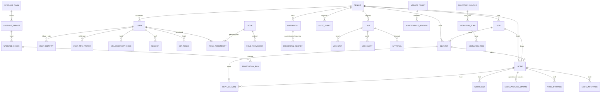

# Velnox — Voorstel databaseschema

> **Vertaling.** Bron: [docs/database-schema.md](../database-schema.md) @ `5fd136a`.
> **Engels is leidend.** Bij verschil tussen deze tekst en de Engelse versie geldt de Engelse tekst.

**Status:** Phase 0 ontwerpvoorstel. PostgreSQL 16, Prisma-migraties.
Dit is het model op hoofdlijnen: entiteiten, belangrijkste velden, relaties en de regels die tenancy en
secretbeheer veilig maken. Detail op kolomniveau wordt per fase vastgelegd in het werkelijke
Prisma-schema.

---

## 0. Conventies

- **Primaire sleutels:** `id` — UUID v7 (tijdsorteerbaar, indexvriendelijk, niet te raden).
- **Tijdstempels:** `created_at`, `updated_at` op elke tabel; `deleted_at` (zachte verwijdering) alleen
  waar historie ertoe doet — nooit op `audit_events`.
- **Tenancy:** elke tenant-gebonden tabel draagt een **niet-lege `tenant_id`**, plus gedenormaliseerde
  `site_id` / `cluster_id` waar die bestaan. Die denormalisatie is bewust: ze laat de RBAC-bereikcontrole
  en de Prisma-tenancy-extensie filteren op de rij zelf in plaats van door joins te lopen.
- **Enums** zijn PostgreSQL-enums, gegenereerd uit de gedeelde TypeScript-catalogus.
- **Secrets** komen nergens als platte kolom voor. Alleen `credential_secrets.ciphertext` bevat
  versleuteld materiaal.
- **`audit_events`** is alleen-toevoegen, afgedwongen door een trigger die `UPDATE` en `DELETE` vanuit
  de applicatierol weigert.

---

## 1. Overzicht van entiteiten en relaties

---

## 2. Tenancy en organisatie

### `tenants`
| Kolom | Type | Toelichting |
|---|---|---|
| id | uuid | |
| name | text | |
| slug | citext uniek | gebruikt in URL's |
| kind | enum | `MSP_ROOT` \| `CUSTOMER` |
| parent_tenant_id | uuid null | gereserveerd voor toekomstige subtenants; v1 kent één niveau onder de root |
| status | enum | `ACTIVE` \| `SUSPENDED` \| `ARCHIVED` |
| settings | jsonb | huisstijl, standaarden, notificatiebestemmingen |

**Invariant:** precies één rij met `kind = MSP_ROOT`, afgedwongen door een partiële unieke index. Die
wordt door de installatiewizard aangemaakt en kan nooit worden verwijderd.

### `sites`
`id, tenant_id, name, code, address, timezone, contact, notes` — een fysieke of logische locatie.
Clusters en standalone nodes horen bij een locatie; een locatie hoort bij precies één tenant.

---

## 3. Identiteit, sessies en RBAC

### `users`
`id, tenant_id (thuistenant), email citext uniek, display_name, status (ACTIVE|DISABLED|INVITED),
password_hash (mag leeg zijn — SSO-gebruikers hebben er geen), password_algo, must_change_password,
mfa_enrolled (afgeleid, bijgehouden door trigger), locale (mag leeg zijn — valt terug op
Accept-Language en daarna 'en'), timezone, token_version int, last_login_at, failed_login_count,
locked_until`

`password_hash` bevat een Argon2id PHC-tekst. `token_version` verhoogt bij wachtwoordwijziging,
rolwijziging of gedwongen uitloggen en maakt uitstaande access tokens ongeldig.

### `user_mfa_factors`
`id, user_id, kind (TOTP|WEBAUTHN), label, secret_ref (→ credentials, leeg voor WEBAUTHN),
credential_public_key (alleen WEBAUTHN), sign_count, confirmed_at, last_used_at, disabled_at,
created_ip`

De TOTP-seed is **geen kolom** — het is een verwijzing naar de credential store, versleuteld zoals elk
ander secret. Een factor is pas bruikbaar zodra `confirmed_at` gezet is, wat vereist dat de gebruiker
tijdens het aanmelden een werkende code aantoont; dat voorkomt buitensluiting door een half afgeronde
inrichting. Een partiële unieke index houdt één bevestigde TOTP-factor per gebruiker aan.
`kind = WEBAUTHN` is gereserveerd en niet geïmplementeerd in v1.

### `mfa_recovery_codes`
`id, user_id, code_hash, used_at, used_ip, generated_at, generation int`

Argon2id-gehasht, eenmalig bruikbaar, precies één keer getoond bij het genereren. Opnieuw genereren
maakt de vorige `generation` in zijn geheel ongeldig. Een gebruikte code wordt bewaard (niet verwijderd)
zodat het auditspoor kan tonen dat een herstelpad is gebruikt — een signaal dat het alarmeren waard is.

### MFA-beleid
Staat op `system_settings.mfa_policy` en, overschrijfbaar, op `tenants.settings.mfa_policy`:
`OPTIONAL` (standaard) | `REQUIRED_FOR_PRIVILEGED` | `REQUIRED`. Het geldende beleid voor een gebruiker
is de strengste van de twee. `REQUIRED_FOR_PRIVILEGED` betekent "bezit enig `*.manage`-, `*.execute`- of
`credentials.rotate`-recht op enig bereik".

### `identity_providers`
`id, kind (LOCAL|OIDC), name, enabled, discovery_url, client_id, client_secret_ref (→ credentials),
tenant_id_claim, allowed_email_domains, auto_provision (bool), default_role_id, default_tenant_id,
jit_group_mappings jsonb`

Het Entra ID client secret is **geen** kolom — het is een verwijzing naar de credential store.

### `user_identities`
`id, user_id, provider_id, subject (stabiele id van de provider), email_at_link, linked_at`
Uniek op `(provider_id, subject)`. Een OIDC-login wordt eerst op `subject` gematcht, en pas op een
geverifieerd e-mailadres wanneer de provider daarvoor is geconfigureerd.

### `sessions`
`id, user_id, refresh_token_hash, family_id, parent_id, ip, user_agent, created_at, last_used_at,
mfa_satisfied_at, expires_at, revoked_at, revoked_reason`

Een sessie met een lege `mfa_satisfied_at` bereikt, wanneer het geldende beleid MFA vereist, alleen de
aanmeld- en uitlogendpoints — afgedwongen door een globale guard, zodat nieuwe endpoints standaard
gedekt zijn. Refresh-rotatie maakt een kindrij; het aanbieden van een reeds geroteerd token trekt de
hele `family_id` in (hergebruikdetectie).

### `api_tokens`
`id, tenant_id, user_id, name, token_hash, prefix, scopes (permission[]), scope_type, scope_id,
expires_at, last_used_at, revoked_at`

### `roles`
`id, key, name, description, is_system (bool), tenant_id (leeg = globale systeemrol)`
Systeemrollen zijn geseed en onveranderlijk. Eigen rollen per tenant dragen een `tenant_id`.

### `role_permissions`
`role_id, permission` — `permission` is een tekstwaarde die tegen de vaste catalogus in
`packages/shared` wordt gevalideerd. Bewust tekst en geen foreign key naar een rechtentabel, zodat een
recht toevoegen een codewijziging plus datamigratie is, en geen invoerscherm tijdens gebruik.

### `role_assignments`
| Kolom | Toelichting |
|---|---|
| id, user_id, role_id | |
| scope_type | `GLOBAL` \| `TENANT` \| `SITE` \| `CLUSTER` |
| scope_id | leeg bij `GLOBAL` |
| granted_by, granted_at, expires_at | tijdelijke verhoging van rechten wordt ondersteund |

Uniek op `(user_id, role_id, scope_type, scope_id)`. `GLOBAL` is alleen invoegbaar voor gebruikers met
de MSP-hoofdtenant als thuistenant — afgedwongen in de servicelaag *en* via een check-constraint met
trigger.

---

## 4. Proxmox-inventaris

### `clusters`
`id, tenant_id, site_id, name, kind (CLUSTER|STANDALONE), pve_version, quorum_ok, quorate_nodes,
expected_votes, health (OK|WARNING|CRITICAL|UNKNOWN), last_seen_at, last_discovery_at,
discovery_error`

Ceph-kolommen: `ceph_present, ceph_version, ceph_release, ceph_health (HEALTH_OK|HEALTH_WARN|
HEALTH_ERR|UNKNOWN), ceph_health_detail jsonb, ceph_pgs_total, ceph_pgs_clean, ceph_osds_up,
ceph_osds_in, ceph_osds_total, ceph_mon_quorum_size, ceph_mon_quorum_expected, ceph_flags text[],
ceph_versions_homogeneous bool`

`ceph_flags` is operationeel van belang: een cluster waar `noout` na afgebroken onderhoud is blijven
staan, is een stille tijdbom, en wordt daarom geïnventariseerd, in de UI getoond en gealarmeerd.

Een standalone node wordt gemodelleerd als een cluster van één. Daarmee blijft elk vervolgpad — rolling
updates, upgradeplannen, guards — uniform in plaats van te vertakken op "is dit standalone".

### `nodes`
| Groep | Kolommen |
|---|---|
| identiteit | `id, tenant_id, site_id, cluster_id, hostname, fqdn, address, api_port, ssh_port` |
| verbinding | `api_credential_id, ssh_credential_id, tls_fingerprint_sha256, tls_verify_mode, ssh_host_key_fingerprint` |
| versie | `pve_version, pve_release, kernel_version, debian_release, subscription_status, repository_status jsonb` |
| gezondheid | `status (ONLINE|OFFLINE|UNKNOWN|MAINTENANCE), health, uptime_seconds, last_seen_at` |
| capaciteit | `cpu_sockets, cpu_cores, cpu_model, cpu_usage_pct, mem_total_bytes, mem_used_bytes, disk_total_bytes, disk_used_bytes` |
| updates | `updates_available_count, security_updates_count, kernel_update_pending, reboot_required, last_update_check_at` |
| vlaggen | `maintenance_mode, managed (bool), notes` |

`tls_verify_mode` is `PINNED_FINGERPRINT` \| `CA_BUNDLE` \| `SYSTEM`. Er bestaat geen waarde `INSECURE`.

### `ceph_daemons`
`id, tenant_id, site_id, cluster_id, node_id, kind (MON|MGR|OSD|MDS|RGW), daemon_id (bijv. "osd.7",
"mon.pve1"), version, release, state (UP|DOWN|STANDBY|ACTIVE|UNKNOWN), osd_in bool, osd_up bool,
osd_device, osd_used_bytes, osd_total_bytes, mds_rank, mds_active, last_seen_at`

Ceph-upgrades herstarten **daemons**, geen nodes, dus daemons moeten volwaardige rijen zijn: ze zijn de
werkeenheid van het Ceph-playbook, de eenheid waarop de guards oordelen, en de eenheid waartegen het
upgraderapport geschreven wordt. Uniek op `(cluster_id, daemon_id)`.

### `node_storages`, `node_interfaces`
Opslag per node (`storage_id, type, shared, total/used/avail bytes, enabled, active, content_types`) en
netwerkinterfaces (`iface, type, method, address, cidr, gateway, bridge_ports, active, mtu`).

### `workloads`
Eén tabel voor QEMU-VM's en LXC-containers, onderscheiden door `kind`.

`id, tenant_id, site_id, cluster_id, node_id, vmid int, kind (QEMU|LXC), name, status
(RUNNING|STOPPED|PAUSED|UNKNOWN), os_type, cpu_cores, mem_bytes, disk_bytes, tags text[], ha_managed,
ha_state, ha_group, template (bool), agent_enabled, boot_firmware (SEABIOS|OVMF), uptime_seconds,
last_seen_at`

> **Expliciet benoemde afwijking van de opdracht:** de opdracht noemt `VM` en `Container` als aparte
> modellen. Ze delen circa 90% van hun kolommen en elke afnemer (inventaris, migratiedoelen, rolling
> updates, HA-controles) behandelt ze identiek. Eén `workloads`-tabel met een `kind`-discriminator
> voorkomt dat elke query, index en guard gedupliceerd wordt. De API biedt nog steeds `/vms` en
> `/containers` als afzonderlijke gefilterde resources, zodat het externe contract overeenkomt met de
> opdracht. Eén woord en het worden twee tabellen.

### `inventory_snapshots`
`id, tenant_id, cluster_id, node_id, taken_at, payload jsonb, job_id`
Ruwe momentopname, bewaard met instelbare houdbaarheid. Gebruikt voor de voor/na-rapportage van upgrades
en om parsing te onderzoeken zonder de node van een klant opnieuw te bevragen.

---

## 5. Credentials

### `credentials`
`id, tenant_id, scope_type (TENANT|SITE|CLUSTER|NODE|EXTERNAL_SYSTEM), scope_id, kind
(PVE_API_TOKEN|PVE_PASSWORD|SSH_PASSWORD|SSH_KEY|WINRM_PASSWORD|OIDC_CLIENT_SECRET|VMWARE_PASSWORD),
username, realm, label, status (ACTIVE|PENDING|NEEDS_ATTENTION|REVOKED), rotation_policy_id,
last_rotated_at, next_rotation_at, last_verified_at, store_backend (DATABASE|VAULT|AZURE_KV),
external_ref`

Uitsluitend metadata. Geen secretmateriaal.

### `credential_secrets`
`id, credential_id, version int, status (PENDING|ACTIVE|SUPERSEDED|REVOKED), ciphertext bytea,
iv bytea, auth_tag bytea, wrapped_dek bytea, key_version int, algo, created_at, activated_at,
superseded_at, purge_after`

Geversioneerd zodat rotatie crashbestendig is (zie de rotatievolgorde in
[architecture.md](architecture.md#rotatievolgorde-crashbestendig)). Precies één `ACTIVE`-versie per
credential, afgedwongen door een partiële unieke index.

### `rotation_policies`
`id, tenant_id, name, scope_type, scope_id, enabled, interval_days, password_length, password_charset,
maintenance_window_id, retain_superseded_days, notify_targets jsonb`

---

## 6. Jobs

### `jobs`
`id, tenant_id, type, playbook_id, playbook_version, status, priority, created_by_user_id,
created_by_token_id, target_kind, target_ids uuid[], params jsonb (nooit secrets), concurrency_key,
progress_pct, current_phase, current_step, queued_at, started_at, finished_at, error_code,
error_message, result_summary jsonb, parent_job_id, cancel_requested_at, cancel_requested_by,
bullmq_id`

`concurrency_key` (meestal `cluster:<id>`) voorkomt dat twee muterende jobs hetzelfde cluster
tegelijk raken — afgedwongen in de wachtrij *en* door een partiële unieke index op actieve jobs.

### `job_steps`
`id, job_id, node_id, phase, step_key, sequence, status (PENDING|RUNNING|SKIPPED|SUCCEEDED|FAILED|
ROLLED_BACK), started_at, finished_at, attempt, output jsonb (gestructureerd, geredigeerd), error`

### `job_events`
`id, job_id, step_id, at, level (DEBUG|INFO|WARN|ERROR), event_key, message, data jsonb`
Alleen-toevoegen, via SSE naar de UI gestreamd. Data is getypeerd per `event_key`; ruwe commando-uitvoer
gaat naar `job_logs`, niet hierheen.

### `job_logs`
`id, job_id, step_id, stream (STDOUT|STDERR|PVE_TASK), content text (in omvang begrensd, geredigeerd),
truncated bool`

### `approvals`
`id, job_id, step_id, tenant_id, required_permission, reason, change_set jsonb, requested_at,
decided_at, decided_by_user_id, decision (APPROVED|REJECTED), decision_note, expires_at`

---

## 7. Updates

### `update_policies`
`id, tenant_id, name, kind (SECURITY_CRITICAL|STANDARD|MANUAL_APPROVAL), enabled, scope_type, scope_id,
auto_apply, require_approval, reboot_policy (NEVER|IF_REQUIRED|ALWAYS), rolling_concurrency int,
abort_on_first_failure, package_allowlist text[], package_denylist text[], maintenance_window_id,
notify_targets jsonb`

### `maintenance_windows`
`id, tenant_id, name, timezone, rrule text, duration_minutes, blackout_dates date[]`
Herhaling opgeslagen als RFC 5545 RRULE, server-side geëvalueerd in de eigen tijdzone van het venster.

### `node_package_updates`
`id, tenant_id, node_id, package, current_version, candidate_version, origin, priority, is_security,
is_kernel, is_proxmox, detected_at, applied_at, job_id`

### `update_runs`
Een view over `jobs` van type `UPDATE_*`, samengevoegd met de uitkomsten per node — updatehistorie zonder
een tweede toestandsmachine.

---

## 8. Major upgrades

### `upgrade_plans`
`id, tenant_id, cluster_id, name, kind (PVE_MAJOR|CEPH|PBS|COMPOSITE), from_version, to_version,
playbook_id, playbook_version, parent_plan_id, sequence, status (DRAFT|PREFLIGHT|BLOCKED|READY|RUNNING|
COMPLETED|FAILED|CANCELLED), strategy jsonb (gelijktijdigheid, herstartbeleid, afbreekregels),
version_matrix_id, created_by, approved_by, scheduled_for`

Een `COMPOSITE`-plan heeft kindplannen geordend op `sequence` — zo wordt een PVE 8 → 9-upgrade van een
Ceph-cluster uitgedrukt: kind 1 is het `CEPH`-plan, kind 2 het `PVE_MAJOR`-plan. Een kindplan kan ook op
zichzelf bestaan, waardoor "alleen Ceph upgraden" een gewone handeling is en geen uitzondering.
`version_matrix_id` legt vast **welke versiematrix dit plan opleverde**, zodat een rapport
interpreteerbaar blijft nadat de matrix is bijgewerkt.

### `upgrade_targets`
`id, plan_id, target_kind (NODE|CEPH_DAEMON), node_id, ceph_daemon_id, daemon_group (MON|MGR|OSD|MDS|
RGW, leeg voor nodes), sequence, status, pre_state jsonb, post_state jsonb, started_at, finished_at`

`pre_state`/`post_state` zijn de voor/na-momentopnames waaruit het rapport van fase 7 wordt opgesteld. De
discriminator `target_kind` zorgt dat één rapport, één voortgangsmodel en één UI zowel een
node-voor-node PVE-upgrade als een daemon-voor-daemon Ceph-upgrade bedienen.

### `upgrade_checks`
`id, target_id, source (PVE8TO9|CEPH_HEALTH|CEPH_VERSION_MATRIX|VELNOX_GUARD), parser_version,
check_key, severity (PASS|INFO|WARNING|BLOCKER|UNKNOWN), title, detail, raw_line, remediation_id (mag
leeg zijn), run_index int (0 = eerste preflight, 1+ = hercontroles), created_at`

`run_index` maakt "preflight opnieuw draaien na herstel en vergelijken" een query in plaats van een
inschatting.

### `remediation_runs`
`id, tenant_id, job_id, target_id, check_id, remediation_id, risk, mode (AUTOMATIC|APPROVED),
change_set jsonb, backup_ref, status (PLANNED|APPROVED|APPLIED|VALIDATED|FAILED|ROLLED_BACK),
applied_at, validated_at, rollback_at, error`

`change_set` bevat de exact geplande diff — hetzelfde object dat de operator vóór goedkeuring zag, zodat
het auditspoor bewijst dat wat goedgekeurd werd gelijk is aan wat draaide.

---

## 9. Migraties

### `migration_sources`
`id, tenant_id, site_id, kind (VMWARE_VCENTER|VMWARE_ESXI|HYPERV), name, address, port, credential_id,
tls_fingerprint_sha256, status, last_discovery_at, discovery_error`

### `source_workloads`
Ontdekte inventaris uit een bronsysteem: `id, tenant_id, source_id, external_id, name, power_state,
cpu_count, mem_bytes, firmware, secure_boot, has_vtpm, has_snapshots, guest_os, tools_status,
generation (Hyper-V), disks jsonb, nics jsonb, datastores jsonb, discovered_at`

### `migration_plans`
`id, tenant_id, source_id, name, target_cluster_id, target_node_id, target_storage,
target_bridge_map jsonb, disk_format (QCOW2|RAW), strategy (PVE_ESXI_IMPORT|OFFLINE_CONVERT|
OPERATOR_ASSISTED), status, compatibility_report jsonb, estimated_downtime_seconds, created_by`

### `migration_items`
`id, plan_id, source_workload_id, target_vmid, status, warnings jsonb, blockers jsonb, job_id,
started_at, finished_at`

`compatibility_report` is verplicht voordat een plan `DRAFT` mag verlaten. Een plan met onopgeloste
blokkades kan niet worden uitgevoerd — de UI toont ze; ze worden niet verstopt achter een knop "toch
migreren".

---

## 10. Audit, meldingen, notificaties, instellingen

### `audit_events` (alleen-toevoegen)
`id, at, tenant_id, actor_type (USER|API_TOKEN|SYSTEM|SCHEDULER), actor_id, actor_label,
impersonated_by, action, resource_type, resource_id, resource_label, result (SUCCESS|FAILURE|DENIED),
ip, user_agent, request_id, job_id, metadata jsonb, prev_hash, hash`

`prev_hash`/`hash` vormen een optionele hashketen per tenant, zodat manipulatie op databaseniveau
detecteerbaar is. `metadata` gaat door dezelfde redactiepijplijn als logs vóór het invoegen. Een trigger
weigert `UPDATE`/`DELETE` vanuit de applicatierol; opschonen op basis van bewaartermijn draait onder een
aparte rol en wordt zelf geaudit.

### `alerts`
`id, tenant_id, severity, kind, resource_type, resource_id, title, detail, status (OPEN|ACKNOWLEDGED|
RESOLVED|SUPPRESSED), first_seen_at, last_seen_at, count, acknowledged_by, resolved_at, dedup_key`

### `notifications` / `notification_channels`
Kanaal: `id, tenant_id, kind (EMAIL|WEBHOOK|TEAMS), config jsonb, enabled, secret_ref`.
Notificatie: afleverpogingen, status, laatste fout.

### `system_settings`
Tabel met één rij: `initialized (bool), initialized_at, instance_id, product_name, base_url, key_version,
mfa_policy (OPTIONAL|REQUIRED_FOR_PRIVILEGED|REQUIRED), default_locale, default_timezone, source_url,
build_commit, feature_flags jsonb, retention jsonb, schema_version`

`product_name` staat hier en wordt door de frontend gelezen, zodat hernoemen vanaf "Velnox" een
instellingswijziging plus assetwissel is — geen codewijziging. `source_url` en `build_commit`
ondersteunen de verplichting uit AGPL artikel 13: ze zijn wat `GET /api/v1/system/source` en
**Instellingen → Over** tonen, en een operator met een aangepaste build wijst `source_url` naar de eigen
broncode.

---

## 11. Indexen en constraints met securitygewicht

| Constraint | Doel |
|---|---|
| `UNIQUE (kind) WHERE kind = 'MSP_ROOT'` op `tenants` | precies één hoofdtenant |
| `UNIQUE (credential_id) WHERE status = 'ACTIVE'` op `credential_secrets` | één actieve secretversie |
| `UNIQUE (concurrency_key) WHERE status IN (QUEUED,PREFLIGHT,RUNNING,VALIDATING)` op `jobs` | nooit twee muterende jobs op één cluster |
| `UNIQUE (provider_id, subject)` op `user_identities` | geen kaping van een OIDC-identiteit |
| `UNIQUE (user_id) WHERE kind='TOTP' AND confirmed_at IS NOT NULL AND disabled_at IS NULL` op `user_mfa_factors` | één actieve TOTP-factor per gebruiker; een onbevestigde aanmelding kan een werkende nooit overschaduwen |
| `UNIQUE (cluster_id, daemon_id)` op `ceph_daemons` | daemonidentiteit blijft stabiel over discoveries |
| `CHECK ((target_kind='NODE') = (node_id IS NOT NULL))` op `upgrade_targets` | een doel is een node of een daemon, nooit beide of geen van beide |
| samengestelde index met `(tenant_id, …)` voorop op **elke** tenant-gebonden tabel | het tenantfilter is altijd door een index gedekt, zodat het verplichte filter niets kost |
| trigger `audit_events_no_mutate` | onveranderlijkheid |
| `CHECK (scope_type <> 'GLOBAL' OR user_is_msp_root(user_id))` op `role_assignments` | globale toekenningen alleen voor MSP-hoofdgebruikers |

---

## 12. Seeding

- **Migraties** maken uitsluitend schema aan — nooit data die een account impliceert.
- **Systeemseed** (draait bij elke uitrol, idempotent): rechtencatalogus, systeemrollen met hun
  rechtensets, standaard updatebeleid als *sjablonen* (uitgeschakeld), typen notificatiekanalen.
- **Ontwikkelseed** (`pnpm db:seed:dev`, weigert te draaien bij `NODE_ENV=production`): demotenants,
  locaties, gefingeerde clusters en workloads, en testgebruikers met wachtwoorden die bij het genereren
  op de console worden getoond.
- **Er is geen standaardaccount en geen standaardwachtwoord in productie.** De eerste beheerder komt
  uitsluitend uit de installatiewizard.

---

*Velnox™ is een handelsmerk van The Velnox Foundation.*
