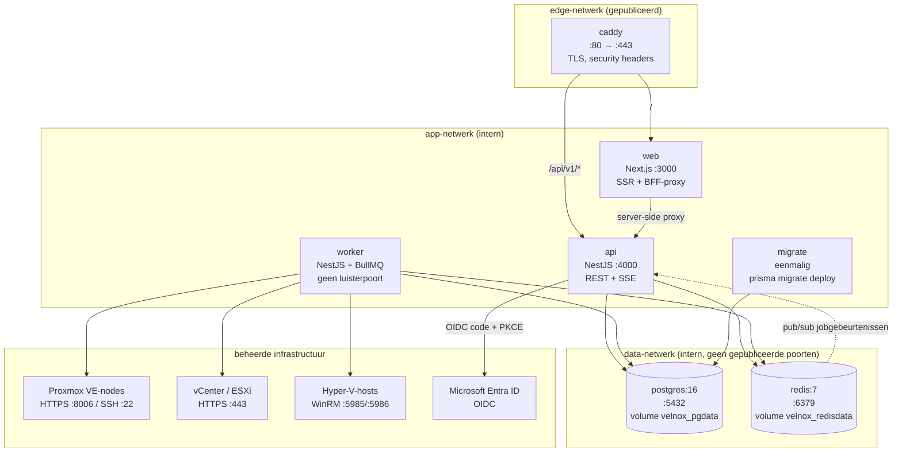
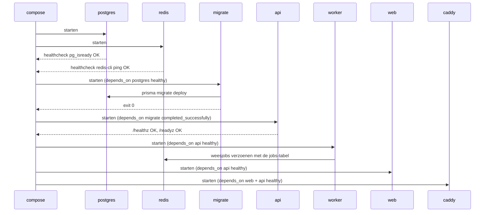
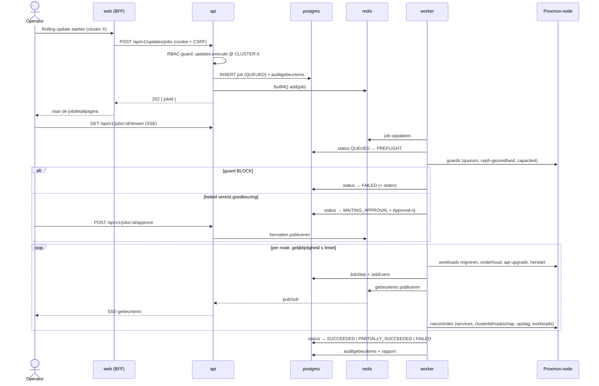

# Velnox — Servicediagram

> **Vertaling.** Bron: [docs/service-diagram.md](../service-diagram.md) @ `d74c8b1`.
> **Engels is leidend.** Bij verschil tussen deze tekst en de Engelse versie geldt de Engelse tekst.

**Status:** Phase 0 ontwerpvoorstel.

---

## Containertopologie



**Uitgaandeverkeersregel:** alleen `worker` opent verbindingen naar beheerde infrastructuur. `api`
bereikt precies één extern endpoint — de OIDC-provider — en uitsluitend tijdens een inlogstroom.

---

## Opstart- en afhankelijkheidsvolgorde



`migrate` gebruikt `condition: service_completed_successfully`. Migraties draaien nooit tijdens het
opstarten van `api`: met meer dan één api-replica is dat een race, en een mislukte migratie moet de
uitrol stoppen in plaats van een bedienende container in een crashlus te brengen.

---

## Health checks

| Service | Controle | Interval / timeout / pogingen / startperiode |
|---|---|---|
| postgres | `pg_isready -U velnox -d velnox` | 10s / 5s / 5 / 20s |
| redis | `redis-cli -a $REDIS_PASSWORD ping` | 10s / 5s / 5 / 10s |
| api | `GET /healthz` (proces leeft), gereedheid via `GET /readyz` (DB + Redis + migratieversie) | 15s / 5s / 5 / 40s |
| worker | hartslag-sleutel in Redis, elke 10s ververst; de controle toetst de versheid | 20s / 5s / 5 / 40s |
| web | `GET /api/health` (Next route handler) | 15s / 5s / 5 / 30s |
| caddy | `caddy validate` bij build; tijdens draaien `GET /healthz` via de proxy | 30s / 5s / 3 / 10s |

Alle services gebruiken `restart: unless-stopped`.

---

## Joburitvoering



---

## Trust boundaries

```
┌─ niet vertrouwd ─────────────────────────────────────────┐
│ Browser                                                  │
└───────────────┬──────────────────────────────────────────┘
                │ TLS, HttpOnly-cookie, CSRF-token
┌─ grens 1: authenticatie + RBAC ──────────────────────────┐
│ caddy → web → api                                        │
│ valideert: sessie, rechten, bereik, invoerschema         │
│ KAN NIET: secrets ontsleutelen, een beheerde node bereiken│
└───────────────┬──────────────────────────────────────────┘
                │ jobrecord + wachtrijbericht (geen secrets in de payload)
┌─ grens 2: automatisering + secretgebruik ────────────────┐
│ worker                                                   │
│ KAN: credentials ontsleutelen, SSH, Proxmox-API, WinRM   │
│ KAN NIET: vanaf het netwerk bereikt worden (geen poort)  │
└───────────────┬──────────────────────────────────────────┘
                │ vastgelegde TLS-vingerafdruk / vastgelegde SSH-hostsleutel
┌─ grens 3: klantinfrastructuur ───────────────────────────┐
│ Proxmox-nodes, vCenter/ESXi, Hyper-V-hosts               │
└──────────────────────────────────────────────────────────┘
```

Wachtrij-payloads bevatten **verwijzingen naar credentials, nooit credentialmateriaal**. De worker
herleidt een verwijzing via de `SecretStore` op het moment van gebruik en houdt de platte tekst alleen
in het geheugen zolang de verbinding duurt.

---

*Velnox™ is een handelsmerk van The Velnox Foundation.*
