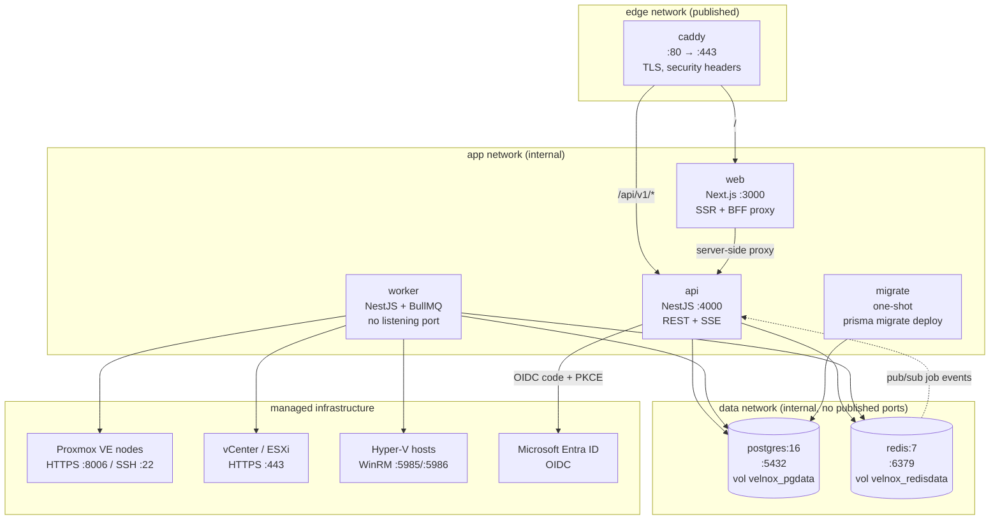
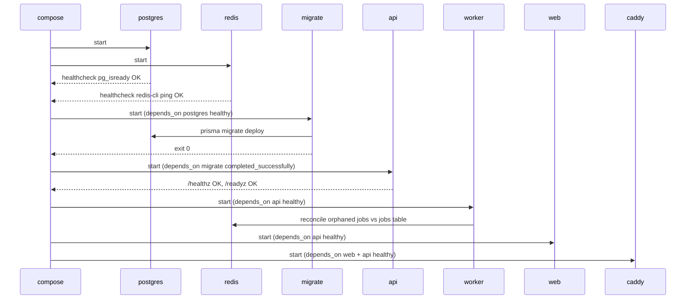
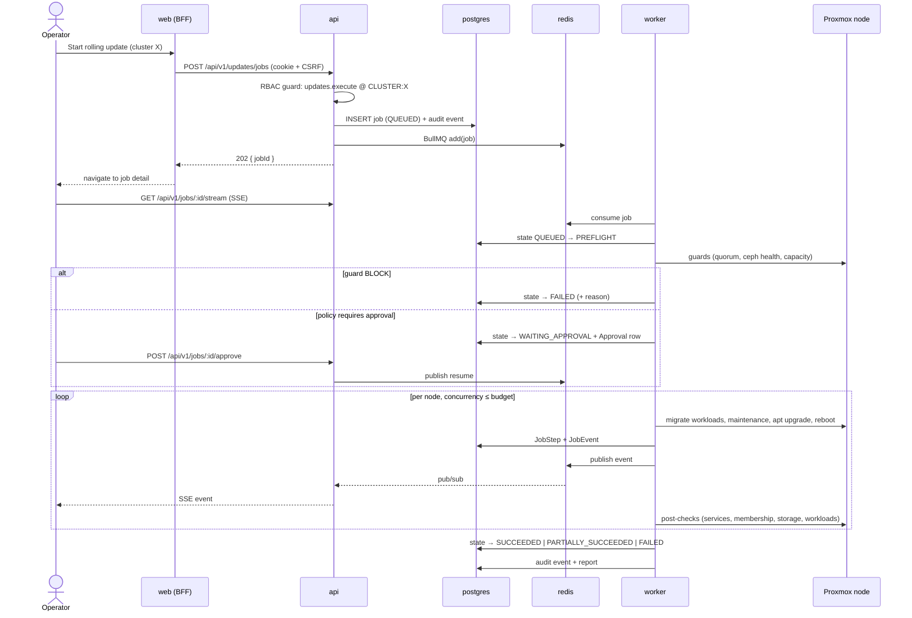

# Velnox — Service Diagram

**Status:** Phase 0 design proposal.

---

## Container topology



**Egress rule:** only `worker` opens connections to managed infrastructure. `api` reaches exactly
one external endpoint — the OIDC provider — and only during a login flow.

---

## Startup and dependency ordering



`migrate` uses `condition: service_completed_successfully`. Migrations never run inside `api` boot:
with more than one api replica that is a race, and a failed migration must stop the deployment
rather than crash-loop a serving container.

---

## Health checks

| Service | Check | Interval / timeout / retries / start period |
|---|---|---|
| postgres | `pg_isready -U velnox -d velnox` | 10s / 5s / 5 / 20s |
| redis | `redis-cli -a $REDIS_PASSWORD ping` | 10s / 5s / 5 / 10s |
| api | `GET /healthz` (process alive), readiness via `GET /readyz` (DB + Redis + migration version) | 15s / 5s / 5 / 40s |
| worker | queue heartbeat key in Redis refreshed every 10s; check asserts freshness | 20s / 5s / 5 / 40s |
| web | `GET /api/health` (Next route handler) | 15s / 5s / 5 / 30s |
| caddy | `caddy validate` at build; runtime `GET /healthz` proxied | 30s / 5s / 3 / 10s |

All services use `restart: unless-stopped`.

---

## Job execution flow



---

## Trust boundaries

```
┌─ untrusted ──────────────────────────────────────────────┐
│ Browser                                                  │
└───────────────┬──────────────────────────────────────────┘
                │ TLS, HttpOnly cookie, CSRF token
┌─ boundary 1: authentication + RBAC ──────────────────────┐
│ caddy → web → api                                        │
│ validates: session, permissions, scope, input schema     │
│ CANNOT: decrypt secrets, reach a managed node            │
└───────────────┬──────────────────────────────────────────┘
                │ job record + queue message (no secrets in payload)
┌─ boundary 2: automation + secret use ────────────────────┐
│ worker                                                   │
│ CAN: decrypt credentials, SSH, Proxmox API, WinRM        │
│ CANNOT: be reached from the network (no listening port)  │
└───────────────┬──────────────────────────────────────────┘
                │ pinned TLS fingerprint / pinned SSH host key
┌─ boundary 3: customer infrastructure ────────────────────┐
│ Proxmox nodes, vCenter/ESXi, Hyper-V hosts               │
└──────────────────────────────────────────────────────────┘
```

Queue payloads carry **credential references, never credential material**. The worker resolves a
reference through the `SecretStore` at the moment of use and holds the plaintext only in memory for
the duration of the connection.

---

*Velnox™ is a trademark of The Velnox Foundation.*
